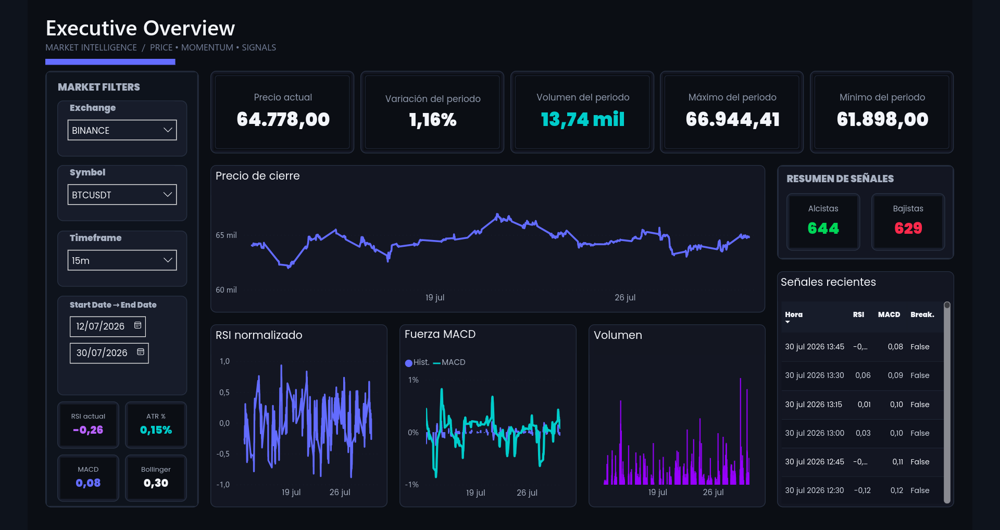
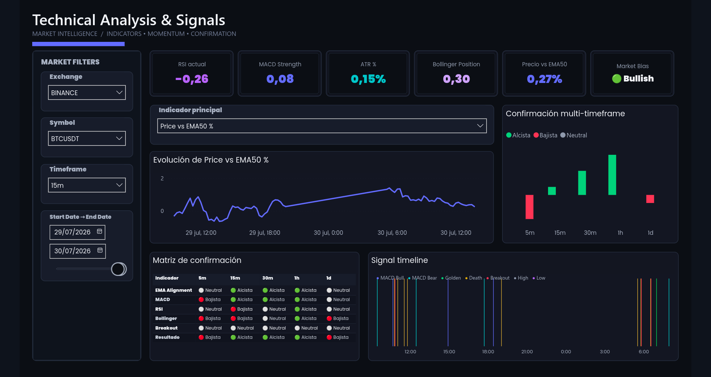
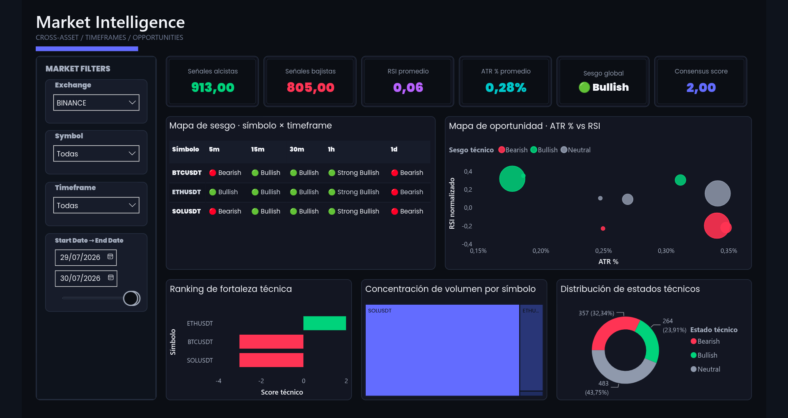

# Power BI Analytics Dashboard

Power BI is the current analytics consumption layer for the market-data
pipeline. The report reads curated Gold views from PostgreSQL and presents
price, technical-indicator, signal, and cross-timeframe analysis through a
versioned PBIP project.

The primary source views are:

- `gold.market_dataset_bi` — feature and signal records across the supported
  market timeframes. Its BI-facing numeric types are adapted for Power BI
  compatibility without changing the canonical Gold tables.
- `gold.market_candles_bi` — unified OHLCV records for price and candle
  analysis.

The semantic model adds shared dimensions and explicit DAX measures so the
report can combine detailed market data with reusable analytical calculations.

## Interactive Report

[View Interactive Power BI Report](https://app.powerbi.com/view?r=eyJrIjoiNjBlZTAwYWYtOGVmMC00N2NmLTkyYTEtODM2M2I1OTk1YWQ3IiwidCI6ImM1NWUwZDRlLTM4YmQtNDllZS1hZGE0LWIzYzQ1MWI0NWU2MyIsImMiOjR9)

The published report is a public portfolio demonstration using non-sensitive
market data.

## Architecture

```text
Gold PostgreSQL
      ↓
BI consumption views
      ↓
Power BI Import
      ↓
Semantic Model
      ↓
DAX Measures
      ↓
Interactive Report
```

The consumption model contains two fact tables:

- `market_candles_bi` for OHLCV and candle-level analysis.
- `market_dataset_bi` for indicators, engineered features, and signals.

The facts share the following dimensions:

- `DimExchange`
- `DimSymbol`
- `DimTimeframe`
- `DimDateTime`

The Gold views form the boundary between the warehouse and the report. In
particular, the BI dataset view provides Power BI-compatible numeric types while
leaving the original Gold tables and their calculations unchanged.

## Report Pages

### 1. Executive Overview

Provides a high-level view of the selected market context with Exchange,
Symbol, Timeframe, and Date filters. The page includes latest price, period
change, period volume, period high and low, close-price evolution, normalized
RSI, MACD strength, volume, and a recent-signals table.



### 2. Technical Analysis & Signals

Focuses on technical-indicator interpretation and signal confirmation. It
includes technical KPI cards, a selectable indicator explorer, multi-timeframe
confirmation, a signal-confirmation matrix, a signal timeline, and technical
signal context.



### 3. Market Intelligence

Provides comparative analysis across symbols and timeframes. The page contains
Exchange, Symbol, Timeframe, and Date filters; bullish and bearish signal
counts; average RSI and ATR; global bias and consensus score; a symbol-by-
timeframe bias matrix; an ATR-versus-RSI opportunity scatter plot; a technical
strength ranking; volume concentration by symbol; and technical-state
distribution.



## Semantic Model

The model follows a star/constellation-style layout: the two facts connect to
shared dimensions through single-direction relationships. The dimensions make
the same slicers reusable across both facts, while explicit DAX measures provide
latest-value KPIs, period metrics, technical summaries, signal counts, dynamic
indicator selection, and multi-timeframe confirmation.

Both fact partitions use Import mode. Measures are persisted in TMDL under the
corresponding fact table definitions, and the model contains 42 explicit DAX
measures across the two facts.

## Features Demonstrated

- PBIP project format with PBIR report definition.
- TMDL semantic model with persisted relationships and measures.
- Shared dimensions for cross-fact filtering.
- Interactive Exchange, Symbol, Timeframe, and Date slicers.
- Dynamic indicator selection through a dedicated selector table and DAX
  measure.
- Matrix and table visuals for confirmation and recent signals.
- Native Power BI cards, line and column charts, combo chart, scatter plot,
  treemap, donut chart, and bar charts.
- Cross-filtering through the shared dimensions and report visual interactions.
- Custom dark theme and a three-page report layout.

## Local Usage

- Open `Market Data BI.pbip` with a compatible version of Power BI Desktop.
- The original data source is PostgreSQL, using the Gold BI consumption views.
- The published report is available as a demo without running the local
  extraction and transformation pipeline.
- A real local refresh requires access to the configured PostgreSQL warehouse,
  the expected schemas and views, and local credentials. No passwords or
  credentials are stored in this repository.
