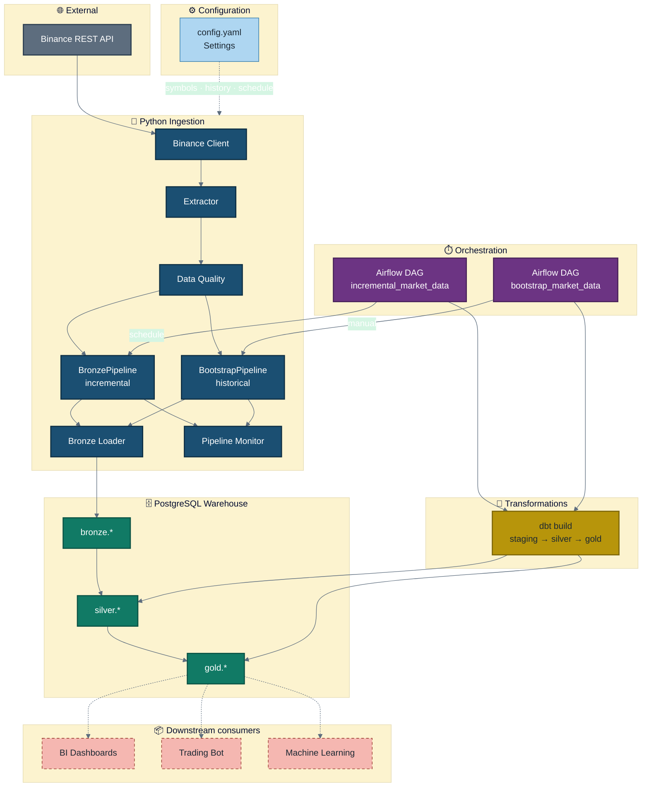

# General Architecture

High-level view of the Market Data Pipeline platform.

**Legend**

| Style | Meaning |
|-------|---------|
| Solid blue | Implemented Python ingestion |
| Green | Warehouse layers |
| Purple | Airflow orchestration |
| Gold | dbt transformations |
| Dashed red | Pending product consumers (not in this repo) |
