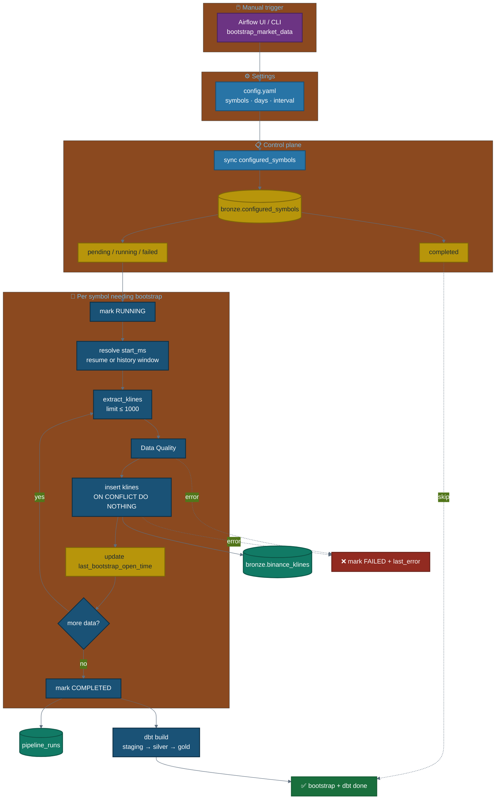
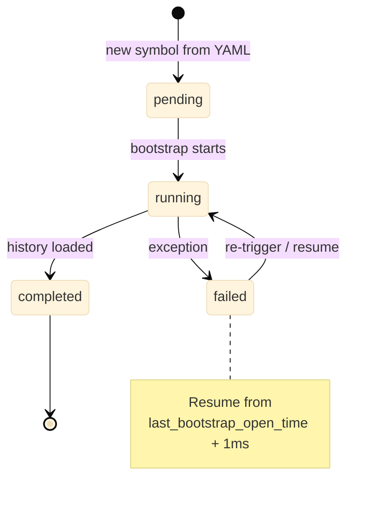

# Bootstrap Pipeline Flow

Manual historical kline load with resume support via `configured_symbols`.

```mermaid
%%{init: {
  "theme": "base",
  "themeVariables": {
    "primaryColor": "#1A5276",
    "primaryTextColor": "#FFFFFF",
    "lineColor": "#5D6D7E",
    "fontFamily": "Inter, Segoe UI, sans-serif"
  },
  "flowchart": { "curve": "basis", "padding": 12 }
}}%%
flowchart TB
    classDef trigger fill:#6C3483,stroke:#4A235A,color:#fff,stroke-width:2px
    classDef cfg fill:#2874A6,stroke:#1B4F72,color:#fff,stroke-width:2px
    classDef state fill:#B7950B,stroke:#7D6608,color:#1C2833,stroke-width:2px
    classDef work fill:#1A5276,stroke:#0E2F44,color:#fff,stroke-width:2px
    classDef store fill:#117A65,stroke:#0B5345,color:#fff,stroke-width:2px
    classDef ok fill:#196F3D,stroke:#145A32,color:#fff,stroke-width:2px
    classDef fail fill:#922B21,stroke:#641E16,color:#fff,stroke-width:2px

    subgraph TRIG["🖱️ Manual trigger"]
        UI["Airflow UI / CLI<br/>bootstrap_market_data"]
    end

    subgraph CFG["⚙️ Settings"]
        YAML["config.yaml<br/>symbols · days · interval"]
    end

    subgraph CTRL["📋 Control plane"]
        SYNC["sync configured_symbols"]
        CS[("bronze.configured_symbols")]
        PEND["pending / running / failed"]
        DONE_S["completed"]
        SYNC --> CS
        CS --> PEND
        CS --> DONE_S
    end

    subgraph LOOP["🔁 Per symbol needing bootstrap"]
        direction TB
        RUN["mark RUNNING"]
        WIN["resolve start_ms<br/>resume or history window"]
        BATCH["extract_klines<br/>limit ≤ 1000"]
        VAL["Data Quality"]
        INS["insert klines<br/>ON CONFLICT DO NOTHING"]
        CUR["update last_bootstrap_open_time"]
        MORE{"more data?"}
        RUN --> WIN --> BATCH --> VAL --> INS --> CUR --> MORE
        MORE -->|yes| BATCH
        MORE -->|no| COMP["mark COMPLETED"]
    end

    BR[("bronze.binance_klines")]
    PR[("pipeline_runs")]
    DBT["dbt build<br/>staging → silver → gold"]
    OK["✅ bootstrap + dbt done"]
    FAIL["❌ mark FAILED + last_error"]

    UI --> YAML
    YAML --> SYNC
    PEND --> RUN
    DONE_S -.->|skip| OK
    INS --> BR
    COMP --> PR
    COMP --> DBT --> OK
    VAL -.->|error| FAIL
    INS -.->|error| FAIL

    class UI trigger
    class YAML,SYNC cfg
    class CS,PEND,DONE_S,CUR state
    class RUN,WIN,BATCH,VAL,INS,MORE,COMP,DBT work
    class BR,PR store
    class OK ok
    class FAIL fail
```

### Status machine

```mermaid
%%{init: { "theme": "base" }}%%
stateDiagram-v2
    [*] --> pending: new symbol from YAML
    pending --> running: bootstrap starts
    running --> completed: history loaded
    running --> failed: exception
    failed --> running: re-trigger / resume
    completed --> [*]

    note right of failed
      Resume from
      last_bootstrap_open_time + 1ms
    end note
```
