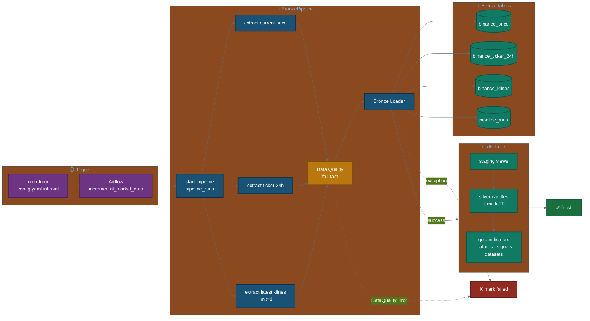
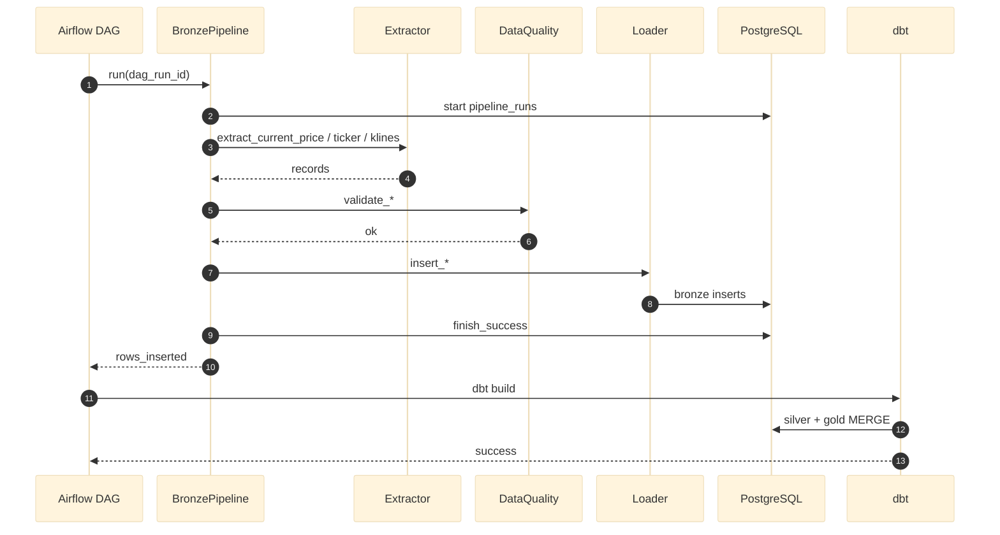

# Incremental Pipeline Flow

Scheduled continuous path: latest market state into Bronze, then full dbt graph.

```mermaid
%%{init: {
  "theme": "base",
  "themeVariables": {
    "primaryColor": "#1A5276",
    "primaryTextColor": "#FFFFFF",
    "lineColor": "#5D6D7E",
    "fontFamily": "Inter, Segoe UI, sans-serif"
  },
  "flowchart": { "curve": "basis", "nodeSpacing": 30, "rankSpacing": 40 }
}}%%
flowchart LR
    classDef trigger fill:#6C3483,stroke:#4A235A,color:#fff,stroke-width:2px
    classDef step fill:#1A5276,stroke:#0E2F44,color:#fff,stroke-width:2px
    classDef gate fill:#B9770E,stroke:#7E5109,color:#fff,stroke-width:2px
    classDef store fill:#117A65,stroke:#0B5345,color:#fff,stroke-width:2px
    classDef ok fill:#196F3D,stroke:#145A32,color:#fff,stroke-width:2px
    classDef fail fill:#922B21,stroke:#641E16,color:#fff,stroke-width:2px

    subgraph TRIG["⏱️ Trigger"]
        CRON["cron from<br/>config.yaml interval"]
        DAG["Airflow<br/>incremental_market_data"]
        CRON --> DAG
    end

    subgraph BRONZE_RUN["🐍 BronzePipeline"]
        direction TB
        S["start_pipeline<br/>pipeline_runs"]
        P["extract current price"]
        T["extract ticker 24h"]
        K["extract latest klines<br/>limit=1"]
        V["Data Quality<br/>fail-fast"]
        L["Bronze Loader"]
        S --> P --> V
        S --> T --> V
        S --> K --> V
        V --> L
    end

    subgraph TABLES["🗄️ Bronze tables"]
        T1[("binance_price")]
        T2[("binance_ticker_24h")]
        T3[("binance_klines")]
        T4[("pipeline_runs")]
    end

    subgraph DBT["🔧 dbt build"]
        STG["staging views"]
        SIL["silver candles<br/>+ multi-TF"]
        GLD["gold indicators<br/>features · signals<br/>datasets"]
        STG --> SIL --> GLD
    end

    DONE["✅ finish"]
    ERR["❌ mark failed"]

    DAG --> S
    L --> T1
    L --> T2
    L --> T3
    L --> T4
    L -->|success| DBT
    DBT --> DONE
    V -.->|DataQualityError| ERR
    L -.->|exception| ERR

    class CRON,DAG trigger
    class S,P,T,K,L step
    class V gate
    class T1,T2,T3,T4,STG,SIL,GLD store
    class DONE ok
    class ERR fail
```

### Sequence (same run)

```mermaid
%%{init: { "theme": "base", "sequence": { "actorMargin": 20, "messageMargin": 30 } }}%%
sequenceDiagram
    autonumber
    participant AF as Airflow DAG
    participant BP as BronzePipeline
    participant EX as Extractor
    participant DQ as DataQuality
    participant LD as Loader
    participant DB as PostgreSQL
    participant DBT as dbt

    AF->>BP: run(dag_run_id)
    BP->>DB: start pipeline_runs
    BP->>EX: extract_current_price / ticker / klines
    EX-->>BP: records
    BP->>DQ: validate_*
    DQ-->>BP: ok
    BP->>LD: insert_*
    LD->>DB: bronze inserts
    BP->>DB: finish_success
    BP-->>AF: rows_inserted
    AF->>DBT: dbt build
    DBT->>DB: silver + gold MERGE
    DBT-->>AF: success
```
