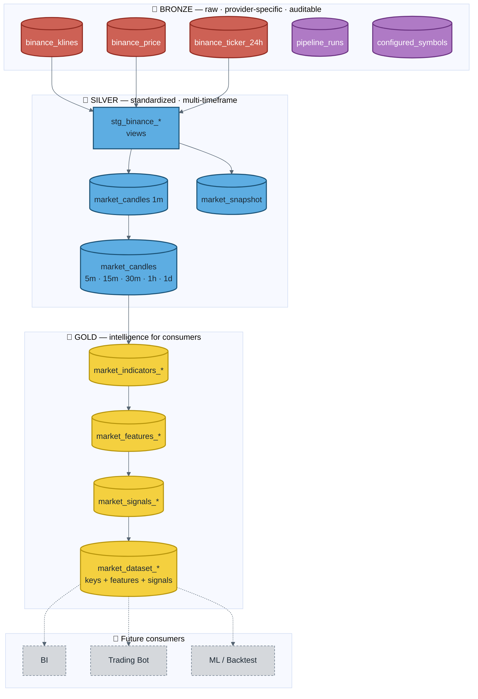

# Medallion Architecture

Data products and refinement path inside the PostgreSQL warehouse.

### Refinement contract

```mermaid
%%{init: { "theme": "base" }}%%
flowchart LR
    classDef b fill:#CD6155,stroke:#922B21,color:#fff
    classDef s fill:#5DADE2,stroke:#1A5276,color:#1C2833
    classDef g1 fill:#F7DC6F,stroke:#B7950B,color:#1C2833
    classDef g2 fill:#F4D03F,stroke:#B7950B,color:#1C2833
    classDef g3 fill:#F1C40F,stroke:#B7950B,color:#1C2833
    classDef g4 fill:#D4AC0D,stroke:#7D6608,color:#1C2833

    A["API payload"] --> B["Bronze facts"]
    B --> C["Silver candles"]
    C --> D["Indicators"]
    D --> E["Features"]
    E --> F["Signals"]
    F --> G["Feature tables"]

    class A,B b
    class C s
    class D g1
    class E g2
    class F g3
    class G g4
```

| Layer | Responsibility | Typical materialization |
|-------|----------------|-------------------------|
| Bronze | Preserve provider raw shape + audit | Physical SQL tables |
| Silver | Normalize + aggregate closed candles | dbt view + incremental MERGE |
| Gold | Compute & persist intelligence | dbt incremental MERGE |
